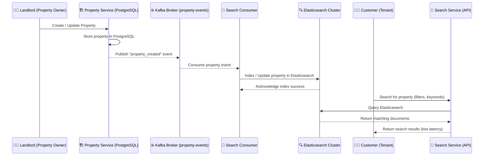

```mermaid

sequenceDiagram
    participant Landlord as 🧑‍💼 Landlord (Property Owner)
    participant PropertySvc as 🏗️ Property Service (PostgreSQL)
    participant Kafka as ☕ Kafka Broker (property-events)
    participant SearchConsumer as 🔄 Search Consumer
    participant ES as 🔍 Elasticsearch Cluster
    participant Customer as 👩‍💻 Customer (Tenant)
    participant SearchSvc as 🧠 Search Service (API)

    Landlord->>PropertySvc: Create / Update Property
    PropertySvc->>PropertySvc: Store property in PostgreSQL
    PropertySvc-->>Kafka: Publish "property_created" event
    Kafka-->>SearchConsumer: Consume property event
    SearchConsumer->>ES: Index / Update property in Elasticsearch
    ES-->>SearchConsumer: Acknowledge index success
    
    Customer->>SearchSvc: Search for property (filters, keywords)
    SearchSvc->>ES: Query Elasticsearch
    ES-->>SearchSvc: Return matching documents
    SearchSvc-->>Customer: Return search results (low latency)

```
