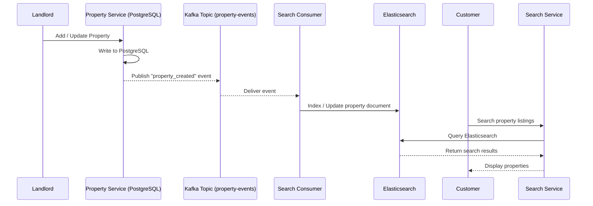
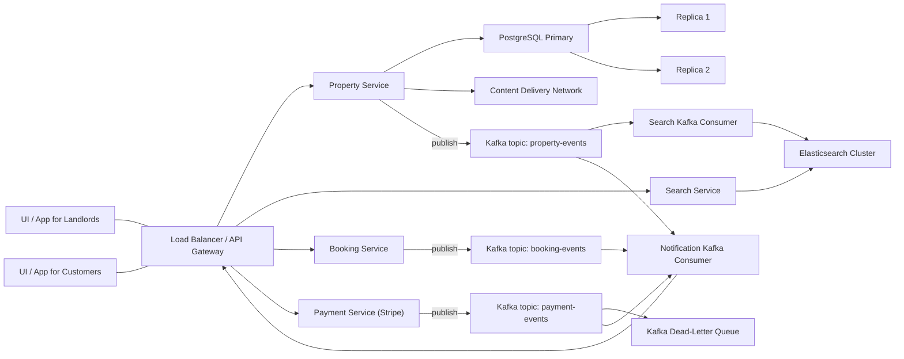

### 🔍 Search Service Architecture

To handle large-scale search queries efficiently, RentEzy separates the **Search Service** (query layer) from the **Search Consumer** (indexing layer).

- **Property Service (PostgreSQL)** handles CRUD for landlords — structured, low-frequency writes.
- **Kafka** acts as the async event bridge between the property DB and search index.
- **Search Consumer** listens to property events and updates **Elasticsearch**, ensuring eventual consistency.
- **Search Service** focuses solely on read queries, scaling horizontally to handle high traffic.

This separation ensures:
- Independent scaling for read-heavy and write-light workloads.
- Search uptime independent of data ingestion.
- Replayable Kafka streams for reindexing or schema migrations.

### 🔍 Search Indexing Flow

