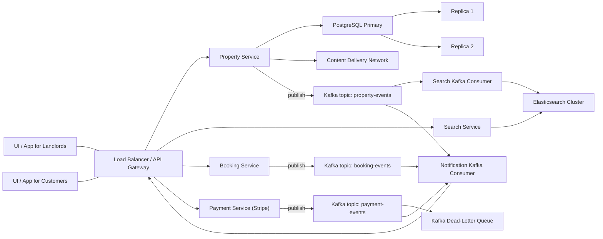

```mermaid
flowchart LR
Manager["UI / App for Landlords"]
Customer["UI / App for Customers"]
LB["Load Balancer / API Gateway"]

PropertySvc["Property Service"]
SearchSvc["Search Service"]
BookingSvc["Booking Service"]
PaymentSvc["Payment Service (Stripe)"]

PGPrimary["PostgreSQL Primary"]
PGReplica1["Replica 1"]
PGReplica2["Replica 2"]

ES["Elasticsearch Cluster"]
CDN["Content Delivery Network"]

topicProps["Kafka topic: property-events"]
topicBookings["Kafka topic: booking-events"]
topicPayments["Kafka topic: payment-events"]
DLQ["Kafka Dead-Letter Queue"]

SearchConsumer["Search Kafka Consumer"]
NotifyConsumer["Notification Kafka Consumer"]

Manager --- LB
Customer --- LB

LB --> PropertySvc
LB --> SearchSvc
LB --> BookingSvc
LB --> PaymentSvc

PropertySvc --> PGPrimary
PGPrimary --> PGReplica1
PGPrimary --> PGReplica2
PropertySvc --> CDN

PropertySvc -- publish --> topicProps
BookingSvc -- publish --> topicBookings
PaymentSvc -- publish --> topicPayments
topicPayments --> DLQ

topicProps --> SearchConsumer
SearchConsumer --> ES

topicProps --> NotifyConsumer
topicBookings --> NotifyConsumer
topicPayments --> NotifyConsumer
NotifyConsumer --> LB

SearchSvc --> ES

```
